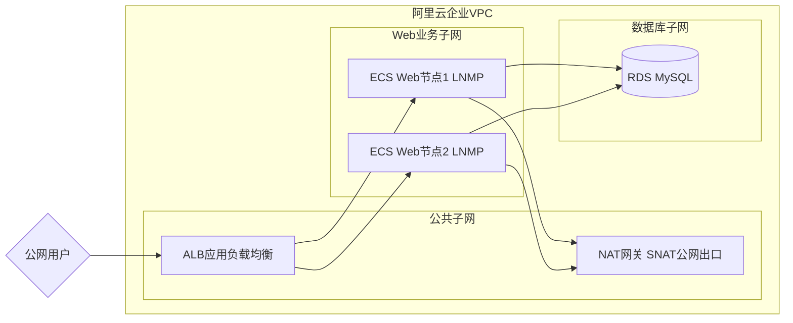

# 总计划
HCIA + HCIP
Python 云自动化入门
云上企业网络架构 + Zabbix监控平台

# 阿里云企业级VPC云上网络架构综合项目总结

> Aliyun Enterprise VPC Network Architecture Project

### 项目涵盖

- 多子网分层架构
- 双层安全防护
- ALB高可用集群
- NAT统一出口
- 内网RDS隔离
- 云监控运维体系
- 完整WordPress业务落地

---

## 项目简介

本项目从零规划并落地一套云上Web业务完整架构，覆盖**网络规划、业务部署、负载均衡、云数据库、访问安全控制、数据异地备份、监控告警、服务器安全加固**全链路。
打通公网用户 → SLB负载均衡 → ECS Web节点 → RDS高可用数据库完整业务访问链路，实现业务高可用、网络隔离、数据容灾、安全运维

---

## ☁️ 使用阿里云产品
VPC、子网、安全组、网络ACL、ECS、SLB负载均衡、RDS MariaDB、OSS对象存储、NAT网关、云监控

---

## 技术栈

| 层级 | 技术组件 | 说明 |
|------|----------|------|
| 计算层 | 阿里云 ECS | CentOS 7.9, LNMP 环境 |
| 网络层 | VPC / 子网 / 安全组 / NACL | 三层隔离架构 |
| 负载均衡 | ALB | 七层应用负载均衡 |
| 数据库 | RDS MySQL | 内网隔离，白名单访问 |
| 网关 | NAT 网关 | SNAT 统一公网出口 |
| 业务 | WordPress | LNMP + WordPress 博客 |
| 监控 | 云监控 + Zabbix | 双轨监控体系 |

---

## ✅ 项目实现功能
1. VPC多子网分层规划：公网子网、应用子网、数据库子网，实现业务网络隔离
2. NAT网关SNAT配置：无公网IP私有ECS访问互联网
3. 双层网络安全防护：安全组（实例级）+ 网络ACL（子网级）访问控制
4. SLB负载均衡：多ECS Web节点流量分发，实现Web层高可用，支持HTTPS
5. 部署WordPress博客，Nginx配置SSL证书提供HTTPS访问
6. RDS MariaDB高可用数据库，主备自动故障切换
7. Shell自动化数据库备份，备份文件上传OSS异地归档，完成备份恢复演练
8. 云监控配置ECS/RDS指标告警，异常主动通知
9. Linux系统安全加固：修改SSH端口、限制root远程登录、fail2ban防暴力破解

---

## 整体架构设计

本项目采用三层隔离式企业架构，完全遵循云上最小权限、分层隔离、安全兜底的生产规范：

- **公共子网**：部署 ALB、NAT 网关，承担流量接入与公网出口
- **Web业务子网**：部署多台 ECS 业务节点，承载网站服务
- **数据库子网**：纯内网隔离 RDS，无任何公网暴露，保障数据安全

### 架构流程图


---

## 🖼️ 架构图
```mermaid
flowchart LR
    User[互联网用户] --> DNS[阿里云云解析DNS]
    DNS --> SLB[公网SLB负载均衡<br/>443 HTTPS/80 HTTP监听]
    subgraph VPC主网段 10.0.0.0/16
        subgraph 公网子网 10.0.1.0/24
        end
        subgraph 应用子网 10.0.2.0/24
            ECS1[ECS Web1<br/>Nginx+WordPress]
            ECS2[ECS Web2<br/>Nginx+WordPress]
        end
        subgraph 数据库子网 10.0.3.0/24
            RDS[RDS MariaDB高可用<br/>主备跨可用区]
        end
        NAT[NAT网关-SNAT<br/>私有ECS访问外网]
    end
    SLB --> ECS1
    SLB --> ECS2
    ECS1 --> RDS
    ECS2 --> RDS
    RDS --> OSS[阿里云OSS<br/>数据库定时备份归档]
    ECS1 & ECS2 --> NAT
    MONITOR[云监控] -.-> ECS1 & ECS2 & RDS
    end
```

---

## 核心项目亮点

- **三层子网隔离架构**：拆分接入层、应用层、数据层，杜绝单点网络混乱，符合企业云上安全规范
- **双层安全防护体系**：网络ACL（子网无状态粗粒度拦截） + 安全组（实例有状态精准放行），双重兜底安全策略
- **NAT网关统一公网出口**：业务ECS无需绑定公网IP，规避服务器直接暴露公网的安全风险
- **ALB负载均衡高可用**：多ECS节点轮询分发，支持故障自动摘除，提升业务可用性
- **数据库内网隔离**：RDS 完全私有子网部署，公网无法访问，仅业务ECS可内网通信
- **全链路监控运维**：CPU、内存、磁盘、带宽、数据库指标监控 + 异常告警，形成完整运维闭环
- **高可用部署**：ALB 负载均衡 + 多 ECS 节点

---

## 部署流程

1. 规划并创建企业级三层 VPC 子网架构
2. 配置网络ACL 子网级出入站拦截规则
3. 配置最小权限安全组策略，细化实例访问权限
4. 部署 NAT 网关 + SNAT 规则，统一服务器公网出口
5. 多台 ECS 初始化，搭建 LNMP 运行环境
6. 创建内网 RDS 数据库，完成数据库初始化
7. 配置 ALB 负载均衡与后端服务器组
8. 部署 WordPress 动态网站，完成业务连通
9. 配置云监控指标、告警策略，实现运维可视化
10. 整体收紧安全策略，完成生产级安全加固

---

## 项目验收标准

- 理解 VPC 虚拟化网络，对应传统机房、广播域思想，衔接 HCIA/HCIP 数通知识
- 掌握云上分层架构设计思路，区分高可用、备份容灾两者不同定位
- 熟悉双层网络安全模型：网络 ACL（子网防火墙）+ 安全组（实例防火墙）
- 掌握自动化运维脚本编写、数据备份恢复完整流程
- 具备独立规划、部署、运维中小型云上 Web 业务架构的能力

---

实验踩坑汇总
修改 SSH 端口前，必须提前在安全组放行新端口，防止远程连接丢失
网络 ACL 默认双向拒绝，新建规则必须手动放行所需端口
RDS 数据库必须配置白名单，否则 ECS 无法内网连接
OSS 备份需要正确配置 ossutil 密钥与权限，否则上传失败
SLB 后端需要配置健康检查，故障节点自动剔除

---

## 验收成果

### 阿里云企业级VPC综合架构搭建项目

- 独立设计并搭建企业级云上VPC网络架构，采用公共、业务、数据库三层子网隔离方案，规避传统单子网权限泛滥风险，输出标准化架构图与完整开源项目文档。
- 搭建网络ACL+安全组双层安全防护体系，基于最小权限原则收紧子网与实例双向流量策略，完成云上安全加固。
- 部署NAT网关实现业务ECS统一公网出口，通过ALB负载均衡实现多节点Web服务高可用，在内网隔离环境下部署RDS数据库，保障数据安全。
- 完整落地LNMP+WordPress动态网站业务，配置全维度云监控告警体系，同时规范GitHub仓库结构、沉淀全套实操文档与部署脚本，实现项目可复现、可落地、可面试讲解。

**核心关键词**：VPC架构设计、云上网络安全、ALB高可用、NAT网关、内网隔离、云运维、项目工程化
